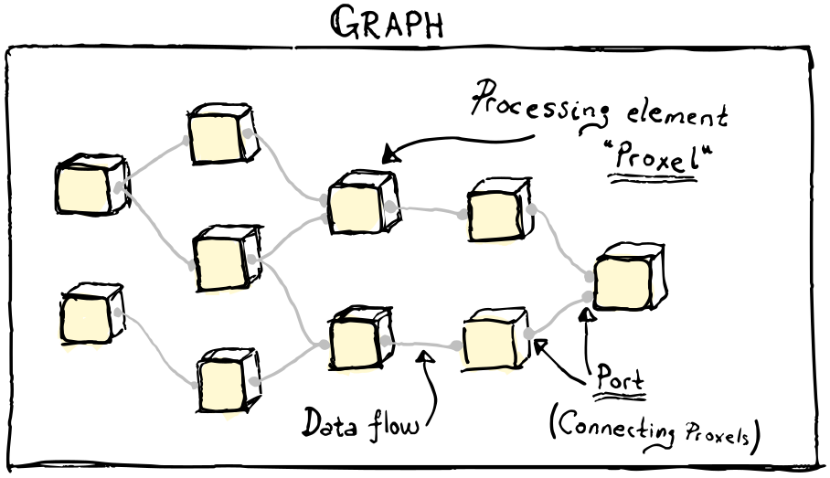

# Superflow - An efficient processing framework for modern C++

Authors: Ragnar Smestad, Martin Vonheim Larsen, Trym Vegard Haavardsholm. 

[](https://opensource.org/licenses/MIT)
&nbsp;
[]()


## Contents

* [What is this?](#what-is-superflow)
* [When should I use this?](#when-should-i-use-superflow)
* [Getting started](#getting-started)
  * [Modules](#modules)
  * [Requirements](#requirements)
  * [Install](#install)
  * [Usage](#usage)
  * [Testing](#testing)
* [Contribute](#contribute)
* [License](#license)
* [Citing](#citing-this-code)


## What is Superflow?

Superflow is made for creating and running flexible processing graphs, where the nodes are the individual processing stages, and the edges are data flows between nodes.
Processing stages are represented by concurrent _proxels_, that encapsulate self-contained parts of the processing system, such as specific algorithms, file or device i/o, or even parts of a graphical user interface.
The data flows are represented by connected _ports_, that together implement a chosen multi-process communication scheme.
A proxel typically has input ports for receiving or requesting data, and output ports for providing results.
The proxels and ports are managed in a container class called _Graph_, which offers a convenient way to start and stop the processing graph, add and connect proxels, monitor the status of the processing graph, and more.
In order to simplify the creation of a graph and to be flexible to changes in content and structure, Superflow provides tools for parsing configuration files containing lists of proxels, parameters and connections.
This can be used to create and start graphs automatically without the need to recompile any code.

The design of Superflow makes it simple to combine different sensors, algorithms and processing stages, and to dynamically reconfigure established processing pipelines.
The framework supports parallel processing, branching and merging of pipelines, and synchronization through barriers and latches.
This is all performed in an efficient, type safe and extendible communication scheme based on modern C++.

A thorough introduction to Superflow is written in [FFI report 24/00556].
The report contains a description of the main components in Superflow, followed by a short tutorial that will get you started on using Superflow in your own applications.



## When should I use Superflow?

In Superflow, data flow and data processing are decoupled and focused through _port_ and _proxel_ abstractions.
This makes it simple to combine different sensors, algorithms and processing stages, and to dynamically reconfigure established processing pipelines.
There are other methods and other libraries available for data processing, which also offer low coupling between the software elements in the pipeline.

In our opinion, however, the main reasons to select Superflow are: 

 - [x] high level of flexibility and efficiency
 - [x] few additional requirements (the `core` module has no dependencies)
 - [x] strongly typed, non-serialized, possibly zero-copy data transfer between proxels through ports
 - [x] no custom build tool or bloated ecosystem, just pure modern CMake

Although originally developed for real-time processing on autonomous vehicles, we are certain that Superflow will be useful in a multitude of other interesting applications as well.

## Getting started

### Modules

In this repository, Superflow comes with the following modules:
- core
- curses
- loader
- yaml

#### core

contains all the required components in order to create proxels and use ports. It does not depend on any external libraries.

#### curses

offers a simple GUI for terminal, based on _ncurses_. It is thus not available for Windows.

See also the [curses/README].

Dependencies:
- ncurses (`libncurses-dev`)
- [Ncursescpp]

#### loader

enables dynamic loading of proxel libraries (shared libraries).
A `loader`-compatible library has embedded a list of which proxels it can provide,
so that the user does not have to include any specific header files or hard code proxel names in their client code.
The functionality is provided by [Boost.DLL].

See also the [loader/README].

Dependencies:
- Boost (`libboost-dev`)
- Boost.Filesystem (`libboost-filesystem-dev`)

#### yaml

enables creation and customization of a processing graph based on YAML formatted configuration files.

Dependencies:
- yaml-cpp (`libyaml-cpp-dev`)

### Requirements

The following installation guide is aimed at Ubuntu Linux.

You will need
- Compiler with support for C++17
- CMake &gt; 3.10.2
- Boost.DLL (for the `loader` module)
- ncurses and ncursescpp (for the `curses` module)
- yaml-cpp (for the `yaml` module)

```bash
sudo apt update
sudo apt install -y \
  build-essential \
  cmake \
  libboost-filesystem-dev \
  libncurses-dev \
  libyaml-cpp-dev
```

See [`ncursescpp`](https://github.com/solosuper/Ncursescpp) for their installation instructions.

### Install

Configure, build and install with CMake.

A typical default setup can be installed like so:
(`sudo` because it is usually required with the default install prefix).

```bash
git clone https://github.com/ffi-no/superflow
cd superflow
cmake -B build  # configure
cmake --build build  # build
[sudo] cmake --build build --target install  # install
```

The configuration step can be customized with additional flags to CMake.
An overview of standard parameter values is given in the table:

| Parameter          | Default |
|:-------------------|:-------:|
|          BUILD_all |      ON |
|       BUILD_curses |     OFF |
|       BUILD_loader |     OFF |
|         BUILD_yaml |     OFF |
|  BUILD_SHARED_LIBS |     OFF |
|        BUILD_TESTS |     OFF |

The `core` module is always on.  
If you e.g. want to turn off `curses`, but keep `loader` and `yaml`,
adapt the configure step:

```bash
cmake -B build -DBUILD_all=OFF -DBUILD_curses=OFF -DBUILD_loader=ON -DBUILD_yaml=ON
```

### Usage
Add Superflow to your CMakeLists.txt

```cmake
find_package(superflow REQUIRED core curses loader yaml)
target_link_libraries(${PROJECT_NAME}
  PUBLIC
  superflow::core
  superflow::curses
  superflow::loader
  superflow::yaml
  )
```

### Testing

You can run the superflow tests like this:

```bash
cmake -B build -DBUILD_TESTS=ON
cmake --build build --target test
```

### Packaging

Superflow has experimental support for packaging. Build the `pack` target in order to create a redistributable Debian package.

```bash
cmake --build build --target pack
# or
cpack -G DEB
# CPack: - package: /(...)/superflow-dev_4.0.0_amd64.deb generated.
```

## Documentation
Documentation can be generated with [doxygen](http://www.doxygen.nl/):

```bash
[sudo] apt install doxygen graphviz

cmake --build build --target doxygen
# or
doxygen ./doc/Doxyfile

# open doc/html/index.html
```

## Contribute

Pull requests are welcome. For major changes, please open an issue first to discuss what you would like to change.
Please make sure to update tests as appropriate.

You are welcome to post issues with bug reports, but due to constrained resources, we are unfortunately not able to accommodate pure feature requests.

## License

The source code is licensed under the [MIT License](https://opensource.org/license/mit/).

## Citing this code

If you find Superflow useful in your work, please cite the [FFI report 24/00556] as

```bibtex
@article{24/00556,
  author = {Ragnar Smestad and Martin Vonheim Larsen and Trym Vegard Haavardsholm},
  title = {Superflow - An efficient processing framework for modern C++},
  journal = {Forsvarets Forskningsinstitutt},
  year = {2024},
  month = {2},
  note = {{FFI}-Rapport 24/00556},
  keywords = {Autonomi, C++ / Programmeringsspråk, Rammeverk, Systemarkitektur},
  FFI-dokument = {{FFI}-Rapport},
  FFI-nummer = {24/00556},
  FFI-gradering = {Ugradert}
}
```

---

[Boost.DLL]: https://www.boost.org/doc/libs/1_65_0/doc/html/boost_dll.html
[curses/README]: curses/README.md
[loader/README]: loader/README.md
[Ncursescpp]: https://github.com/solosuper/Ncursescpp
[FFI report 24/00556]: https://www.ffi.no/publikasjoner/arkiv/superflow-an-efficient-processing-framework-for-modern-c

